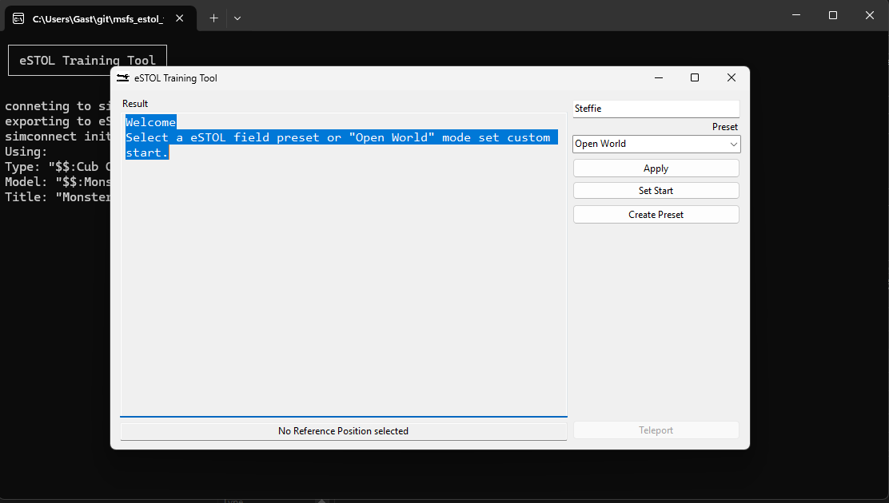
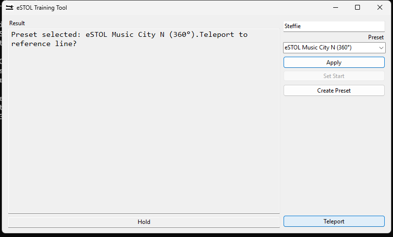
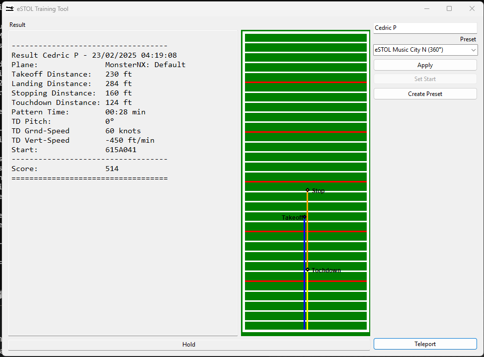
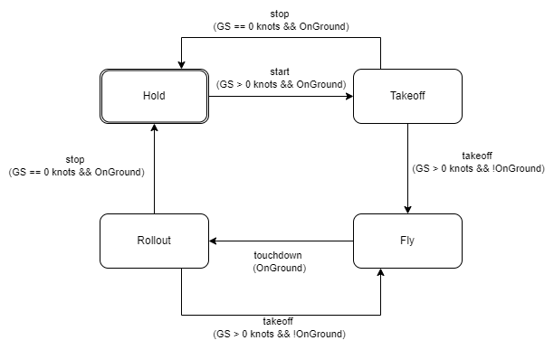

<center></center>

# MSFS eSTOL Training Tool

This Tool is intended for training purposes only.
The numbers give a quick feedback and rough estimate of your performance. They do not guarantee any accuracy.
Do not challenge any competition score based on this tools' estimation alone.\n Make sure to record your flight for any necessary score validation.\n\nPress Enter to accept

This tool is not officially associated with National STOL Series.

## Concept

This tool give quick performance data about a STOL competition run by recording Takeoff and Landing.
Distances are calculated based on an initial start point and heading marking the start line.
from here distances are measures along the heading axis.

<center></center>

StartPoint: initial start point on Start Line
TakeoffPoint: Location where takeoff is detected. First point where plane is not on ground.
TouchdownPoint: Location where the Plane touched down first.
StopPoint: Location where plane came to a full stop.

Takeoff distance: Distance from StartPoint to TakeoffPoint
Touchdown distance: Distance from StartPoint to TouchdownPoint
Landing distance: Distance from StartPoint to StopPoint
Stopping distance: Distance from TouchdownPoint to StopPoint

<center></center>

This tool has two modes: OpenWorld and Presets

### Open World 

The user can set the startpoint everywhere using parking breake or smoke.

### Presets

Start Point are provided as preset for known eSTOL Fields

### Preset Creation

Click the Create Preset Button.
it then provides a preset as JSON you can add to presets.json file.

Example:
```
    {
        "title": "YOUR TITLE",
        "start_lat": 36.378282538897,
        "start_long": -86.409490615829,
        "start_alt": 168,
        "start_hdg": 168
    }
```

## Restrictions

The tool polls aircraft telemety data in an interval off 250ms. This limits the prescision the tool can detect any state changes.
For tochdown and landing it refers to Simconnect variable "SIM ON GROUND". Detection qualaty depends on Sim dettecting this parameter.
The tool does not access Takeoff or Touchdown Events (yet).
The start point and touchdown point are set by plane position. this position most likely refers to planes center of gravity and not to wheels touchdown point.
Since the offset between those is the same for lineup, takeoff and landing if may be ignored. For differen Plane Types, especially those of different size.
to counter this ther is the gear offset feature.
enter an offset to your plane in GearOffset.json until teleport drops you onto the referenceline.

## Usage

start `msts_estol_training_tool.exe`

```
┌─────────────────────┐
│ eSTOL Training Tool │
└─────────────────────┘

Disclaimer:

This Tool is intended for training purposes only.
The numbers give a quick feedback and rough estimate of your performance.They do not guarantee any accuracy.
Do not challenge any competition score based on this tools' estimation alone.
Make sure to record your flight for any necessary score validation.

```

- setup user name used for InfluxDB upload. Leave empty to ignore.
- select mode OpenWorld or select a preset.
- lineup with start line and takeoff -> "takeoff detected"
- fly pattern and land -> "landing detected"
- result is shown after full stop
  - result summary is printed to console and result box
  - result is saved to .csv file
  - result is pushed to InfluxDB
  - state panel shows detected state of flight
 
<center></center>

select a Preset from Dropdown and press "Apply" or set Openworld Start Pos with Button "Set Start"

<center></center>

you are able to teleport directly to referenceline

<center></center>

the result is show as usual in the result box

## States

<center></center>

## Results upload

Results are shared on [Graphana](https://cedricpump.grafana.net/public-dashboards/2f6cc35cb96247f385380cee7f482206)
- [eSTOL Scores Overview](https://cedricpump.grafana.net/public-dashboards/2f6cc35cb96247f385380cee7f482206)
- --[eSTOL Data by User](https://cedricpump.grafana.net/public-dashboards/df511ced3d994fd2b578163e17d9360b)-- broken public
