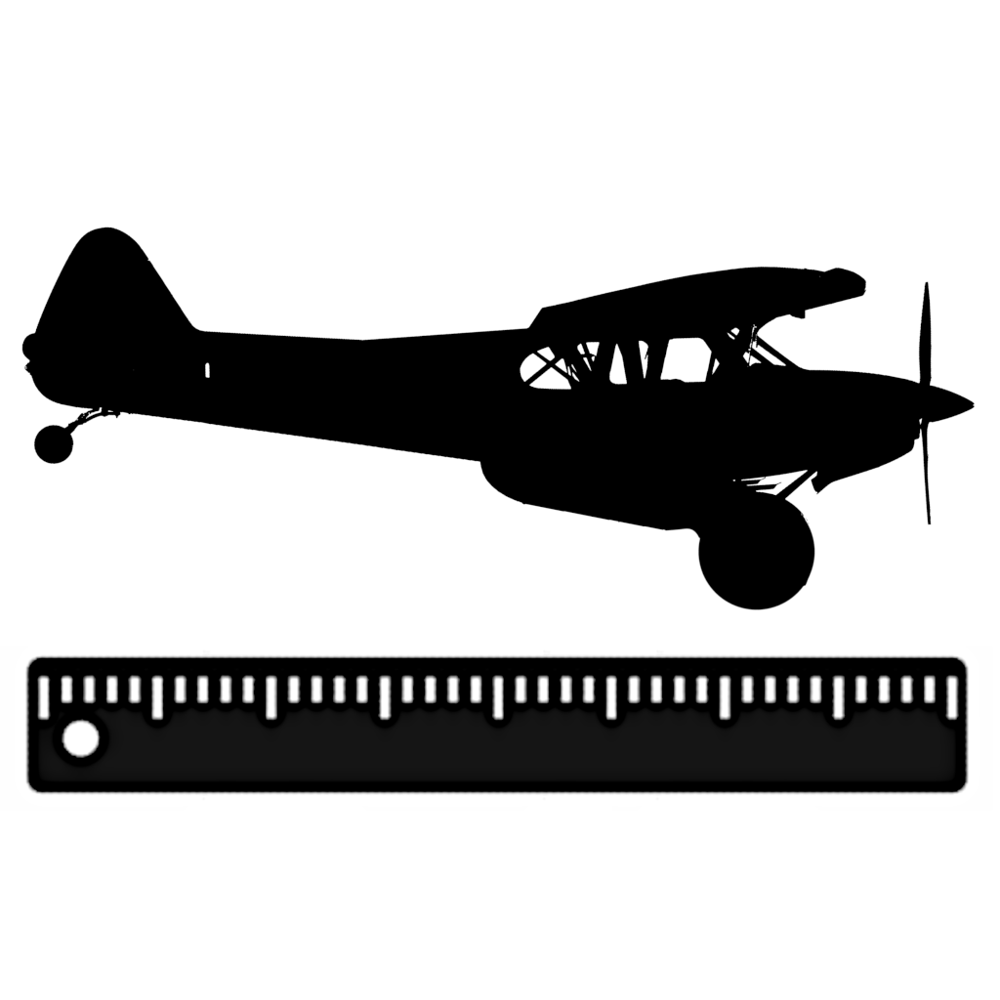
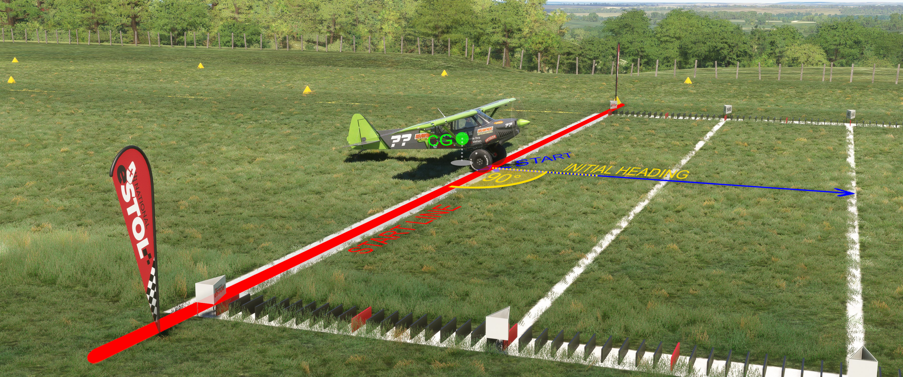
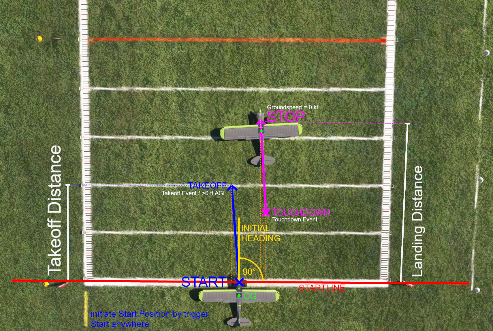

<center></center>

# MSFS eSTOL Training Tool

This Tool is intended for training purposes only.
The numbers give a quick feedback and rough estimate of your performance. They do not guarantee any accuracy.
Do not challenge any competition score based on this tools' estimation alone.\n Make sure to record your flight for any necessary score validation.\n\nPress Enter to accept

This tool is not officially associated with National STOL Series.

## Concept

This tool give quick performance data about a STOL competition run by recording Takeoff and Landing.
Distances are calculated based on an initial start point and heading marking the start line.
from here distances are measures along the heading axis.

<center></center>

StartPoint: initial start point on Start Line
TakeoffPoint: Location where takeoff is detected. First point where plane is not on ground.
TouchdownPoint: Location where the Plane touched down first.
StopPoint: Location where plane came to a full stop.

Takeoff distance: Distance from StartPoint to TakeoffPoint
Touchdown distance: Distance from StartPoint to TouchdownPoint
Landing distance: Distance from StartPoint to StopPoint
Stopping distance: Distance from TouchdownPoint to StopPoint

<center></center>

This tool has two modes: OpenWorld and Presets

### Open World 

The user can set the startpoint everywhere using parking breake or smoke.

###  Presets

Star Point are provided as preset for known eSTOL Fields

## Restrictions

The tool polls aircraft telemety data in an interval off 250ms. This limits the prescision the tool can detect any state changes.
For tochdown and landing it refers to Simconnect variable "SIM ON GROUND". Detection qualaty depends on Sim dettecting this parameter.
The tool does not access Takeoff or Touchdown Events (yet).
The start point and touchdown point are set by plane position. this position most likely refers to planes center of gravity and not to wheels touchdown point.
Since the offset between those is the same for lineup, takeoff and landing if may be ignored. For differen Plane Types, especially those of different size, this may be a Problem when working with presets.

## Usage

start `msts_estol_training_tool.exe`

```
┌─────────────────────┐
│ eSTOL Training Tool │
└─────────────────────┘

Disclaimer:

This Tool is intended for training purposes only.
The numbers give a quick feedback and rough estimate of your performance.They do not guarantee any accuracy.
Do not challenge any competition score based on this tools' estimation alone.
Make sure to record your flight for any necessary score validation.

Press Enter to accept

Input eSTOL User Name: User
Select a eSTOL field preset or "Open World" mode (default):

  [ 0] Open World Mode (set custom start with parking brake)
  [ 1] eSTOL Jennings RW36
  [ 2] eSTOL Jennings RW18
  [ 3] eSTOL Grant Co Intl RW23
  [ 4] eSTOL Grant Co Intl RW05
  [ 5] eSTOL Arklahoma RW31
  [ 6] eSTOL Arklahoma RW13
  [ 7] eSTOL Training RW36
  [ 8] eSTOL Training RW18
  [ 9] eSTOL Johnsons Farm RW31
  [10] eSTOL Johnsons Farm RW13
  [11] EDHL RW25 Threshold (Dev Home)

Enter your selection (0 for Open World, or preset number): You selected Open World Mode.
toggle parking break to inititate START position and heading.
```

- setup user name used for InfluxDB upload. Leave empty to ignore.
- select mode OpenWorld (default, timeout 10sec) or select a preset.
- lineup with start line and takeoff -> "takeoff detected"
- fly pattern and land -> "landing detected"
- result is shown after full stop
  - result summary is printed to console
  - result is saved to .csv file
  - result is pushed to InfluxDB
 
Exsample:

```
...
Enter your selection (0 for Open World, or preset number): 7
You selected: eSTOL Training RW36
STOL cycle initiated: 389975A3
START: N39°2'25,36",W96°4'22,83" HDG: 356°
simconnect init done
Takoff recorded
time: 03:30
Touchdown recorded

-----------------------------------
Result User - 25/11/2024 13:52:45
Plane:               $$:Savage Carbon $$:Zlin Aviation Savage Carbon: Orange
Takeoff Dinstance:   201 ft
Landing Dinstance:   146 ft
Stopping Dinstance:  87 ft
Touchdown Dinstance: 59 ft
Pattern Time:        03:14 min
TD Pitch:            0°
TD Grnd-Speed        30 knots
TD Vert-Speed        -372 ft/min
Start:               389975A3
-----------------------------------
Score:               367
===================================
```

Results are shared on Graphana:
https://cedricpump.grafana.net/goto/xQMI-BnHg?orgId=1

